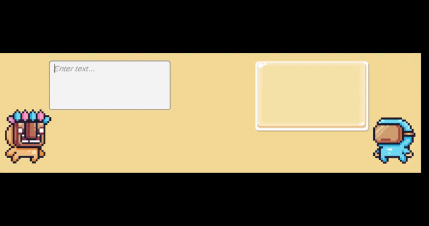

# Rasa-Unity

This project aims to test the integration between Rasa and Unity, contributing to the Rasa repository itself, with the intention of helping the community.

## How to use

1. Clone the repository.

2. Install the dependencies of Rasa, following the steps [here](https://rasa.com/docs/rasa/installation/installing-rasa-open-source).

3. Run the Rasa creation command, selecting the creation path of your preference:

```bash
rasa init
```

**Important**: After creating the Rasa project, access the `Rasa\` folder in this repository, and copy all the files to the folder created with the command `rasa init`. This step is necessary as it modifies the training data, which will be used in the Unity project.

4. Run the Rasa training command:

```bash
rasa train
```

5. Run the Rasa initialization command:

```bash
rasa run
```

6. With Rasa running, open the Unity project in the directory `RasaUnity` that is in this repository, and run the project. Another alternative is to extract the `Build.zip` file and run the project with the executable `RasaUnity.exe`.


## What is the project

The project is a Unity application that uses Rasa to perform a kind of conversation, with the conversation focused on programming and the responses appearing in the form of images. In this sense, Rasa is used to identify the intention of the message sent by the user, and respond according to the identified intention. After this occurs, Rasa returns the response to Unity, which in turn displays the response to the user in the form of an image.





### Specifications and versions used

- Windows 10
- Python 3.9.13
- rasa 3.4.0
- rasa-sdk 3.4.0
- Unity 2021.3.16f1


**OBS:** Project developed as a way to contribute to the Rasa repository, showing a way to connect Rasa with Unity. [Issue #14 (RasaHQ/contributors)](https://github.com/RasaHQ/contributors/issues/14)